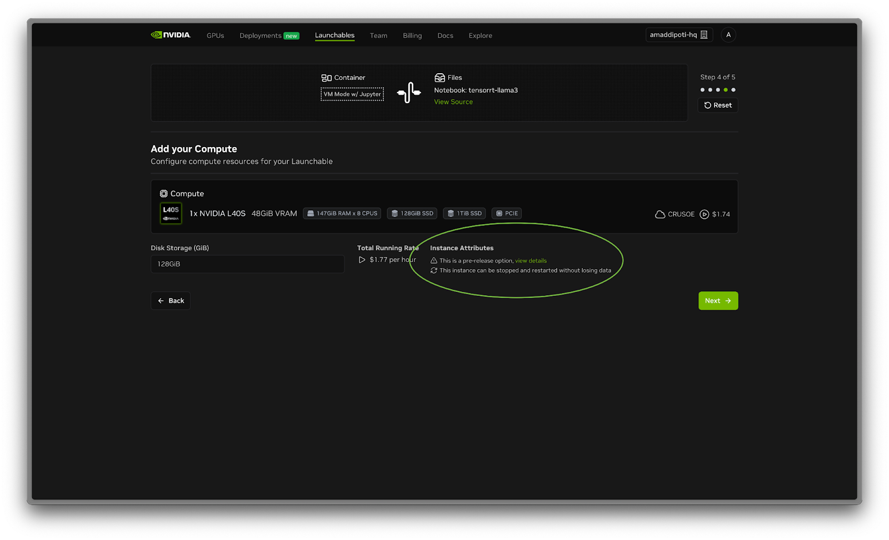

<!-- Banner Image -->

<!-- Links -->

  <a href="https://brev.nvidia.com" style="color: #06b6d4;">Console</a> •
  <a href="https://docs.nvidia.com/brev" style="color: #06b6d4;">Docs</a> •
  <a href="https://github.com/brevdev/launchables" style="color: #06b6d4;">Launchables</a> •
  <a href="https://github.com/brevdev/launchables/blob/main/LAUNCHABLE-CREATION-GUIDE.md" style="color: #06b6d4;">Launchables Guide</a>

# Launchable Creation Guide

Launchables are an easy way to bundle a hardware and software environment into an easily shareable link, allowing for simple demos of GPU-powered software and blueprints.

## Prerequisites / Table of Contents

Launchables are configured upon creation, therefore prior to getting started, make sure you have scoped the following:

### Compute
Brev supports single-node environments at the moment. Multi-node is on the roadmap.

### Container
Determine whether you need containers specified in your environment. You can specify a single container or multiple containers via Docker Compose.
- Containers must be on a public registry (if they require a private registry, see below section)
- Expect 5-10+ minutes for most Launchable instances to spin up, especially if building containers—plan for this in Launchable User Experience.

### Files
Public [GitHub](https://github.com)/[GitLab](https://gitlab.com) Repo or Jupyter Notebook
- Identify the base resources for the Launchable. Use public GitHub/GitLab links only (no private repos supported).

### Ports (optional)
Whether any ports need to be exposed for services:
- Secured tunnels/access applications are limited to HTTP ports only (e.g., Gradio/Streamlit apps, UIs, services, etc.)
- Public ports can be used to expose any port on the VM but can pose potential security risks.

### Test Thoroughly
Please test your Launchables to make sure they run as expected!

## Troubleshooting

If you have any technical questions or run into issues, please reach out to [Brev support](mailto:brev-support@nvidia.com) for assistance.

## Getting Started

1. Create an account on [brev.nvidia.com](https://brev.nvidia.com)
2. On the top navigation bar, click **Launchables**. Click **Create Launchable**

## File Configuration

Next, you will be asked to provide code files to share in the Launchable. Launchables are ideally meant for sharing a code repo or Jupyter notebook guide on top of a GPU environment. You can still create Launchables without code files, or if you have a container that has files inside of it.

### Option 1: I have code files in a git repository

Enter a GitHub URL. In this example, a notebook is being inputted. You can input entire repos as well.

### Option 2: My code files are embedded in my container

This is a rare scenario, but sometimes containers like the RAPIDS container or Bionemo container have embedded code examples (Jupyter Notebooks) that don't require any pre-configured code files on your behalf. If you're taking this pathway, you're specifying that the Launchable doesn't need to put any code files on the GPU VM – the container pulled onto the VM will have the files that an end user will interact with.

### Option 3: I don't have any code files

This is a rare scenario, but if you want to provide end users with a GPU sandbox environment without any guiding code, you can also use Launchables for this use case.

## Runtime Configuration

Determine your runtime environment:

### VM Mode (USUALLY THE MOST OPTIMAL, SIMPLE CONFIGURATION)

Provides a GPU VM in the cloud, with Docker, Python, and CUDA preinstalled. Ubuntu 22.04 as the base OS.

- Does not allow you to choose a container but you have the ability to install dependencies based upon your use case within a terminal/notebook session
- If you have a container that requires a private registry or API keys to pull the image, select the VM Mode option. Then, in your uploaded notebook file, you should specify the steps to authenticate and pull the image.

### With Container(s)

If you require container(s) running for the code sample, you can also specify a Docker Image / Docker Compose YAML.

This adds significant time to the provisioning process, since it takes time to build images/containers. Expect anywhere between 5-15 minutes of additional time.

#### Option 1: Featured Containers

Best for simple demos with a quick setup with a Jupyter notebook experience. These are pre-developed Docker images created by the Brev team. They consist of popular images used commonly by Brev users and come with JupyterLab pre-installed.

#### Option 2: Docker Compose YAML (Advanced)

Best for showcasing complex workflows with multiple containers.

If you have your own Docker image(s) on a public registry, you can manually add containers to be provisioned on the instance. If you already have a pre-created [Docker Compose](https://docs.docker.com/compose/) YAML file, you can also upload it!

**Note:** If your container requires a private registry or API keys to pull the image, click the back button below and select the VM Mode option. Then, in your uploaded notebook file, you should specify the steps to authenticate and pull the image.

## JupyterLab/Tunnels Configuration

Choose whether you want [JupyterLab](https://jupyter.org) on your instance. This depends on if you want your users to go through a Jupyter Notebook/IDE for interacting with the Launchable (HIGHLY RECOMMENDED). Declining means a user will need to SSH into the GPU.

You can also configure whether you want to pre-expose any tunnels or services or set firewall rules on the VM when it is provisioned. This is helpful for any networking necessary for the Launchable workload and your Launchable's users won't need to mess with any networking.

Examples of use cases for tunnels include:
- [Gradio](https://gradio.app)/[Streamlit](https://streamlit.io) UIs
- Microservices/NIMs
- Communication with Servers
- And more!

## Compute Configuration

[Select an NVIDIA GPU](https://brev.nvidia.com/environment/new/public) for your use case, scroll to select your configuration. Please note the following, and choose the most reasonable minimum-cost configuration for your needs:

- Number of GPUs
- Amount of System Memory
- Amount of CPUs
- Cost per hour
- Cloud Provider (AWS, GCP are the most reliable. Crusoe instances have fixed persistent disk size 128GB, but have 1TB of ephemeral storage. Lambda Labs instances cannot be stopped. Azure, Nebius, and Shadeform are also available.)

More NVIDIA Cloud Partner providers are being added every quarter.

Select a configuration by clicking on a specific configuration.

**Note:** Instance Attributes share more about the specific characteristics of a selected instance!

Select **Next** once you are satisfied with the configuration.

## Ensure UX and Scalability

Enter a descriptive name for the Launchable and click **Generate Launchable**.

You can click **Preview Deploy Page** to view what it would look like when people visit your Launchable's URL.

If you feel confident, go ahead and **Create Launchable**! Congratulations!

The following screen is displayed when a launchable is successfully created. You can copy the URL and start sharing it with others!

## Using Your Launchable

1. Click **View Live Deploy Page**. A preview of the Notebook is generated and is loaded. Here the user can read through the notebook but cannot execute code within the cells.

   

2. Click **Deploy Launchable**.

   

3. Click **Go to Instance Page**. Here you can monitor status and view logs. The instance will start first then the configuration will spin up.

   

   **Expect 5-10+ minutes for most Launchable instances, especially if building containers—plan for this in UX.**

   

4. Click **Open Notebook** once your instance is configured.

   

## Please Test Thoroughly!

Run all your cells in order before sharing your notebook, and make sure there are no errors!

Document (1 page): what worked, blockers (e.g., drivers, storage, ports, Jupyter/SSH), and fixes.